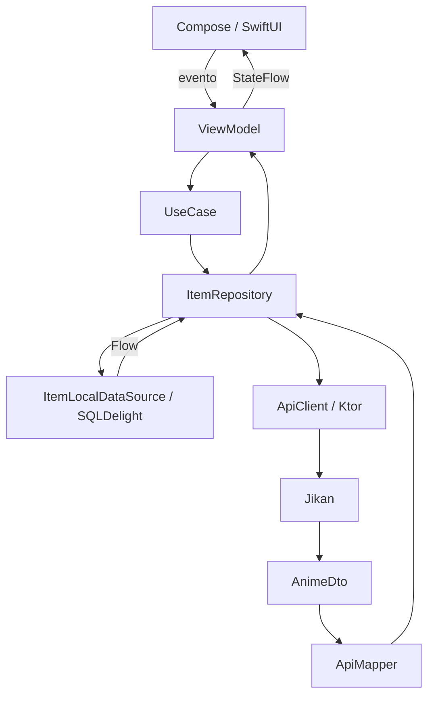

# Arquitectura

AnimeKMP usa flujo unidireccional. Las dos interfaces consumen los mismos ViewModels de Kotlin, pero Android dibuja con Compose e iOS con SwiftUI.

## Capas

`domain` contiene el modelo canónico, contratos y casos de uso. `data` implementa red, mapper, base local y repositorio. `presentation` publica estados con `StateFlow`. `di` conecta las dependencias con Koin. `platform` resuelve conectividad, reloj y logger con `expect/actual`.

## Offline-first

La lista observa SQLDelight. La red actualiza la base y la UI recibe el cambio mediante `Flow`. Si no hay conexión, el catálogo y los favoritos ya guardados siguen disponibles. El TTL predeterminado es una hora.
